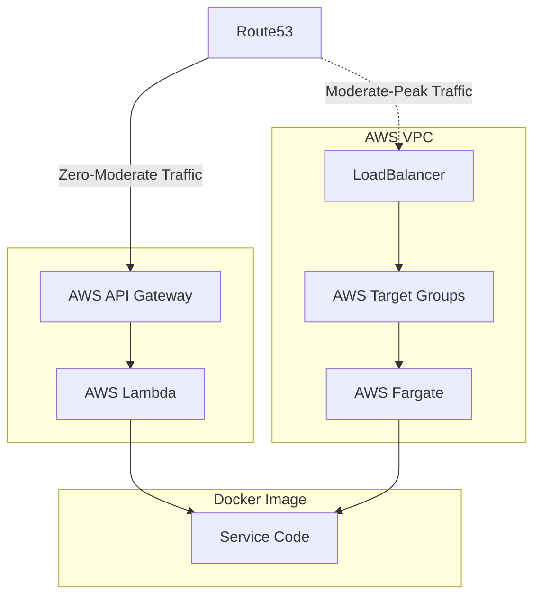

## Scaling Dilemma

When initiating projects, teams often face a critical decision: choosing between a simple setup that may lack future scalability or a more complex, scalable system that can be overkill and costly for initial needs. Opting for simplicity can later make it necessary to overhaul the setup as the project grows, while starting with a scalable solution may result in wasted resources during periods of low utilization. The challenge is compounded by the significant costs associated with transitioning between these two approaches and the absence of a seamless integration between them.

The cloud offers the allure of limitless scaling. However, the essential ability to scale efficiently from zero to peak capacity — and importantly, back down to zero again — continues to be elusive.

## LambdaFlex Strategy

### Exploration of Potential Technologies

We have assessed a range of technologies to fulfill our scaling needs. AWS Lambda and AWS API Gateway shine in scaling from a non-existent base to moderate levels, suiting early development and small deployments. Yet, scaling beyond that to handle very high demand presents challenges. Other services such as AWS EC2, AWS ECS, AWS EKS, AWS Fargate, and AWS App Runner have been considered. Notably, they all do not scale back to zero activity.

### Adoption of AWS Fargate

To overcome this barrier, we elect to implement AWS Fargate for scaling from moderate to peak demand. AWS Fargate is capable of running **the same Docker image** used at the initial AWS Lambda stage, maintaining deployment uniformity.

## Overcoming Challenges

Bridging AWS Lambda and AWS Fargate involves addressing how their scaling mechanisms transition. Initially, AWS API Gateway directs traffic to a dynamic set of AWS Lambda functions as demand fluctuates at the lowest scale level. This functionality must be replicated on AWS Fargate, along with managing the transition between services. Furthermore, AWS Lambda can operate independently of a Virtual Private Cloud (VPC), whereas AWS Fargate requires the presence of one.

## Solution Architecture

The progression from moderate use to peak demand occurs in a phased approach:

1. Initially, AWS Route53, AWS API Gateway, and AWS Lambda are in place to handle incoming requests. 
2. As demand increases, we integrate AWS VPC, AWS Load Balancer, AWS Target Group(s), and AWS Fargate.
3. We modify AWS Route53 to redirect traffic to the AWS Load Balancer, now supported by AWS Fargate.
4. As demand recedes, we systematically dismantle the components — AWS Route53 records, AWS Fargate services, and AWS VPC — transitioning back to the more cost-efficient AWS Lambda at lower scales.

## Summary

The LambdaFlex methodology effectively merges the simplicity of minimal infrastructures with the robustness of highly scalable systems. By fluidly shifting between AWS Lambda for low to moderate demand and AWS Fargate for higher intensities, the solution adapts flexibly to changing project requirements.

## Implementation Notes

### Speed of Scale Up/Down

- **Route53 TTL Consideration:** DNS records for AWS API Gateway and AWS Load Balancer are set with TTL of 60 seconds. This implies that changes may take up to 60 seconds to take effect.
  
- **Scaling Time:** AWS Load Balancer and AWS Fargate deployment(s) are not instantaneous, hence scale-up triggers should be set accordingly.

- **Scale-Down Process:** The scale-down process should consider the TTL of the DNS records and include a delay before tearing down AWS Load Balancer and AWS Fargate services.

### Underlying Service (FastAPI)

The underlying service is implemented with FastAPI, a robust framework for building APIs and generating OpenAPI specifications. It's versatile and can be utilized as is or replaced with any other framework.

### Bootstrapping Logic

The bootstrapping logic resides in the `entrypoint.sh` file. This script detects the environment and initiates the service accordingly and bridges the transition between AWS Lambda and AWS Fargate.

### Detailed deployment diagram

