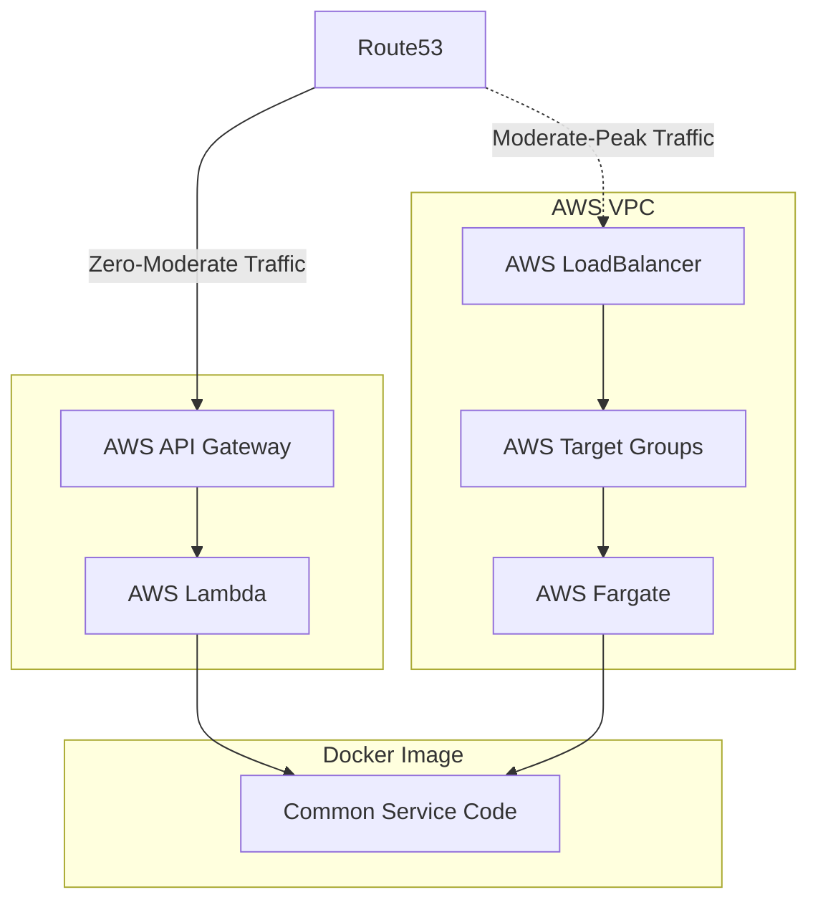
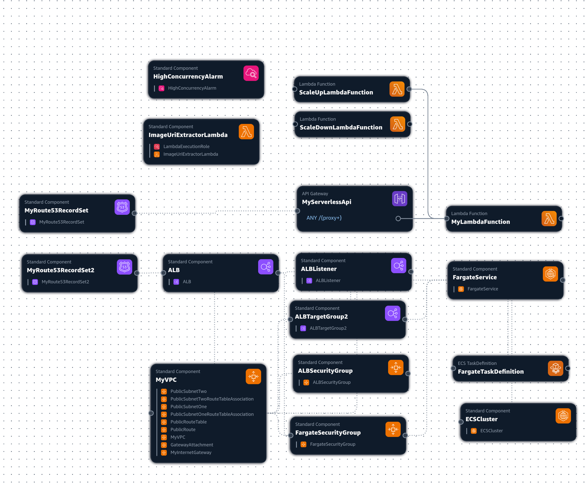
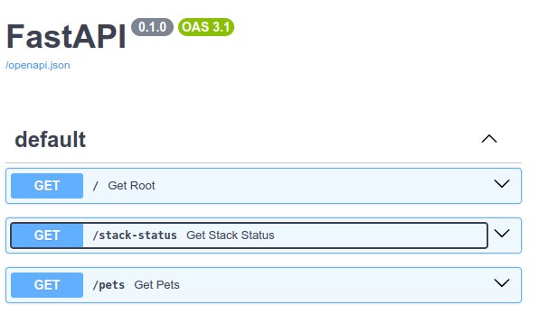

# LambdaFlex

## Dammed if you dammed if you don't

Starting a new project, I often find myself grappling with a familiar dilemma: the choice between a straightforward setup that may lack future scalability and a more scalable infrastructure that could be overkill or costly for initial needs. Opting for simplicity may lead to a future overhaul as the project grows while starting with a scalable solution can introduce complexity and waste resources during periods of low utilization. The agony of this decision arises from the challenging transition between these two approaches and the absence of seamless integration.

The cloud offers the allure of limitless scalability. However, the ability to scale efficiently from zero to peak capacity, and from peak capacity back to zero continues to be elusive.

## Related Technologies

AWS Lambda and AWS API Gateway shine in scaling from a non-existent base to moderate levels, making it suitable for early development and small deployments. Yet, scaling beyond that to handle high demand presents challenges (ie. cold starts, per invocation costs). Other services such as AWS EC2, AWS ECS, AWS EKS, AWS Fargate, and AWS App Runner may fit that niche better... though, they all do not scale to zero.

## Selecting AWS Fargate

To overcome these issues LambdaFlex combines AWS Lamba and AWS Fargate for scaling from moderate to peak demand. AWS Fargate is capable of running **the same Docker image** used at the initial AWS Lambda stage, maintaining deployment uniformity. AWS Fargate allows for most re-use, while AWS App Runner and AWS EKS might be explored as alternatives.

## Integration

Bridging AWS Lambda and AWS Fargate involves addressing how they scale depending on traffic and how traffic is routed between them. Initially, AWS API Gateway directs traffic to AWS Lambda function(s), which scale out as demand transitions from zero to a medium traffic level. This functionality must be replicated on AWS Fargate, along with managing the transition between services. Furthermore, it's noteworthy that AWS Lambda can operate independently of an AWS Virtual Private Cloud (VPC), whereas AWS Fargate requires VPC."

## Workflow

The progression from moderate use to peak demand occurs in a phased approach:

1. Initially, AWS Route53, AWS API Gateway, and AWS Lambda are deployed to handle incoming requests. 
2. As demand increases, AWS VPC, AWS Load Balancer, AWS Target Group(s), and AWS Fargate are deployed
3. AWS Route53 is updated to redirect traffic to the AWS Load Balancer, which is backed by AWS Fargate pods.
4. As demand subsides, the AWS Route53 records, AWS Fargate services, and AWS VPC are removed and the system is back to cost-efficient AWS Lambda deployment.

## Summary

The LambdaFlex methodology effectively merges the simplicity of minimal infrastructures with the robustness of highly scalable systems. By automatically shifting between AWS Lambda for low to moderate demand and AWS Fargate for higher traffic, and back as traffic subsides.

## Implementation Notes

### Speed of Scale Up/Down

- **Route53 TTL Consideration:** DNS records for AWS API Gateway and AWS Load Balancer are set with a TTL of 60 seconds. This implies that changes may take up to 60 seconds to take effect.
  
- **Scaling Time:** AWS Load Balancer and AWS Fargate deployment(s) are not instantaneous, hence scale-up triggers should be tuned accordingly.

- **Scale-Down Process:** The scale-down process should consider the TTL of the DNS records and include a delay before tearing down AWS Load Balancer and AWS Fargate services.

- **Scale Up/Down Automation:** The scale-up/down process is triggered with AWS Cloudwatch alarms and transitions the AWS CloudFormation stack based on configurable thresholds.

### Underlying Service (FastAPI)
The underlying service is implemented with FastAPI, a robust framework for building APIs and generating OpenAPI specifications. It operates independently from AWS Lambda, AWS Fargate, and Docker (despite Docker's benefits, I prefer avoiding its build time and debugging complexities). FastAPI is versatile and can be utilized as is or replaced with any other framework (ex. NodeJS, GO).

### Bootstrapping Logic

The bootstrapping logic resides in the `entrypoint.sh` file. This script evaluates the environment and starts the service according to AWS Lambda or AWS Fargate.

### Detailed deployment diagram

### OpenAPI Specification
* https://lambda-or-anyscale0.cloud.okulist.net/docs
* https://lambda-or-anyscale0.cloud.okulist.net/stack-status

